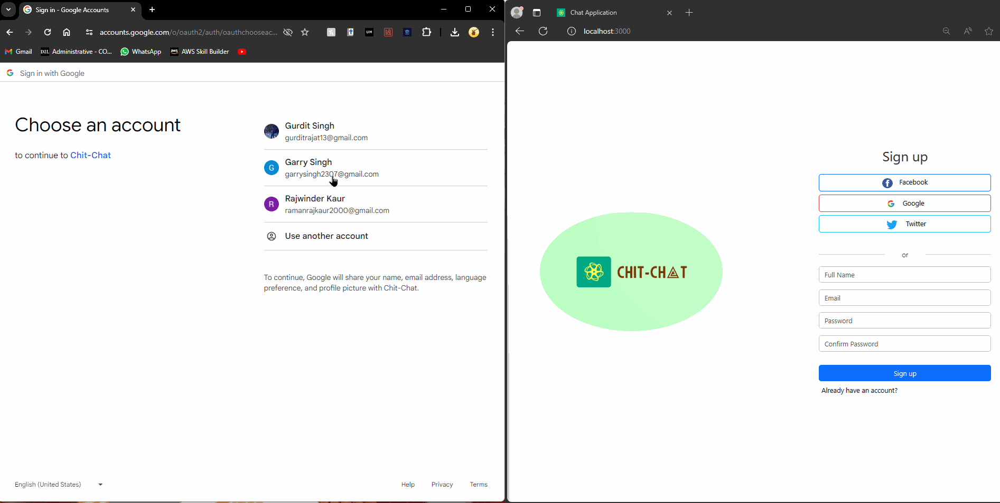

# Chat Application

This chat application enables real-time communication between users through a web interface. It's built using React.js for the frontend and Node.js with Express for the backend. The application uses WebSocket (specifically socket.io) for real-time messaging, allowing messages to be broadcasted to all connected users. PostgreSQL is used for database management, with Nodemon to keep the server running during development, and CORS to handle cross-origin requests.

## Features

- Real-time messaging between connected users.
- Broadcast messages using WebSocket.
- Authenticates user using OAuth.
- Saves Session using Cookies.
- You can't get access to your chats without logging in.
- Shows a list of connected users.
- Saves your Chat history.
   
## Prerequisites

Before running this application, ensure you have the following installed:

- Node.js (latest stable version)
- npm (comes with Node.js)
- PostgreSQL

## Installation

To set up the application, follow these steps:

1. **Clone the repository:**
```
git clone https://github.com/GurditLubana/Chat-Application

```

2. **Install Backend Dependencies:**
Navigate to the main directory where `package.json` for the backend is located and run:
```
npm install
```

3. **Install Frontend Dependencies:**
Navigate to the frontend directory and run:

```
npm install
```
## Configuration

1. **Database Setup:**
- Ensure PostgreSQL is running.
- Create a database for the application.
- Use the `.env.example` file in the main directory to create a `.env` file with your database connection settings and any other environment-specific configurations.

2. **Backend Setup:**
- Ensure all environment variables are set in the `.env` file as per the `.env.example`.

3. **Frontend Setup:**
- If necessary, adjust any environment-specific settings, such as the backend server URL.

## Running the Application

1. **Start the Backend Server:**
In the main directory, run:
```
nodemon server.js
```
The server will start, and Nodemon will watch for changes.

2. **Start the Frontend Application:**
In the frontend directory, run:
```
npm start
```
This will launch the application in your default web browser.

## Future Improvements

- Creating private rooms for specific user groups.
- Enhancing the UI/UX for a better user experience.
- Deploying the application for public access.
